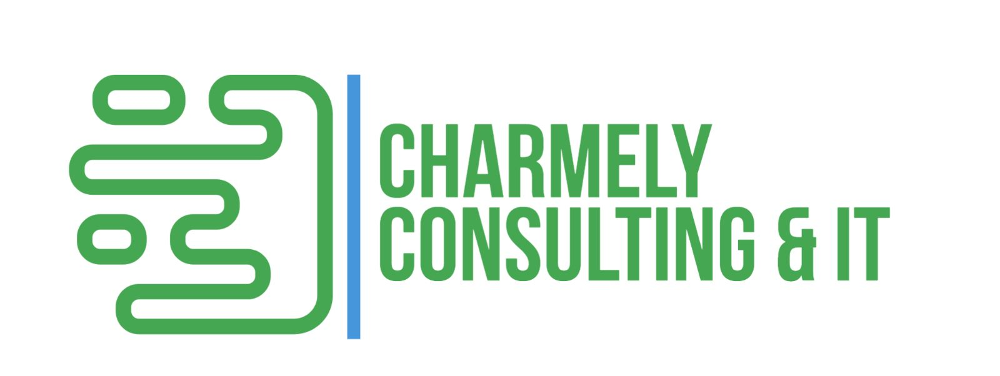
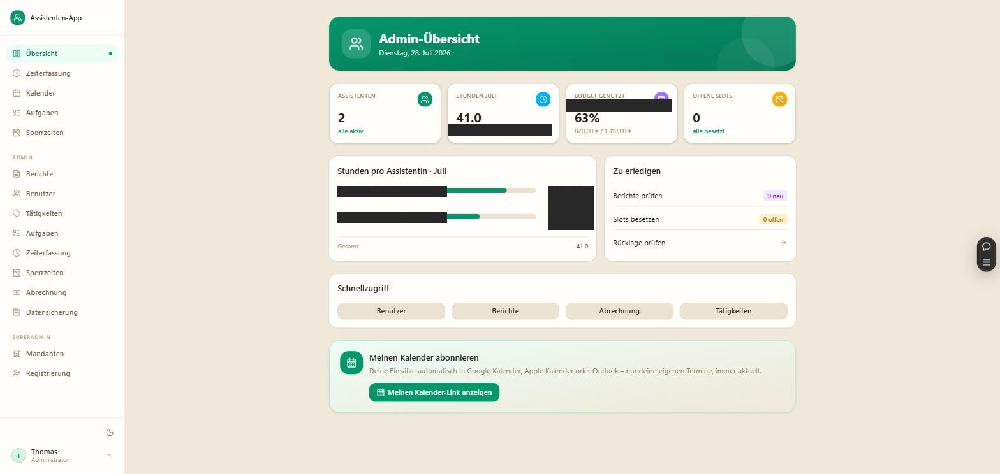
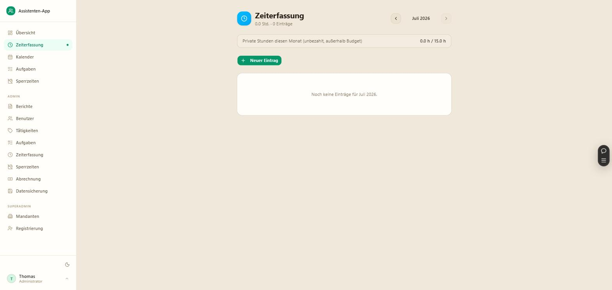
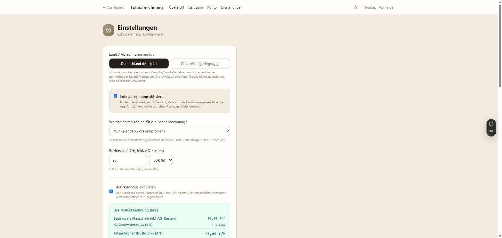
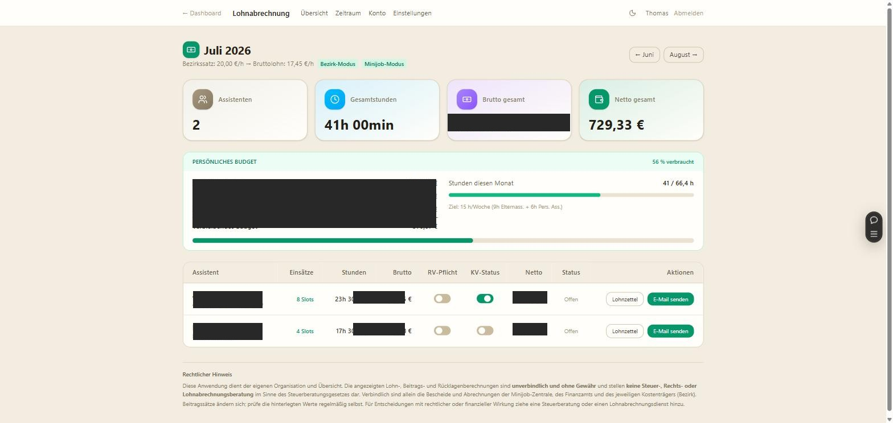

> **Hinweis für die PDF-Gestaltung:** Dieses Logo soll als Kopfzeile auf **jeder Seite** des fertigen PDFs erscheinen (nicht nur auf der ersten Seite).

---

# Assistenten-App — Dienstplanung, Zeiterfassung und Lohnabrechnung für private Arbeitgeber

## Das Problem

Private Arbeitgeber:innen von Minijobber:innen — allen voran Menschen mit Behinderung, die im Arbeitgebermodell (Persönliches Budget) selbst Arbeitgeber:in ihrer Assistenzkräfte sind — führen faktisch einen Kleinbetrieb: Dienstplan, Zeiterfassung, Minijob-Abrechnung inklusive aller Beitragssätze, Nachweise gegenüber dem Kostenträger. Meist ohne betriebswirtschaftliche Vorbildung, oft parallel zum eigenen Unterstützungsbedarf.

Der Alltag heute: Termine per WhatsApp und Telefon abstimmen, handschriftliche Stundenzettel, Excel-Tabellen für die Abrechnung, Nachweise von Hand zusammenstellen. Fehleranfällig, zeitraubend, nervenaufreibend — und bei Fehlern in der Abrechnung wird es schnell teuer.

Marktrecherche bestätigt die Lücke: Bestehende Dienstplan-Tools (Ordio, Papershift, Aplano, Crewmeister & Co.) sind für Schichtbetriebe und Gastronomie gebaut — nicht für den Fall "ein privater Arbeitgeber, ein bis drei Assistenzkräfte, Minijob, ggf. Kostenträger-Abrechnung". Ein Betroffener hat öffentlich berichtet, mangels passender Software selbst eine Lösung entwickelt zu haben.

## Die Lösung: Assistenten-App

Eine Web-App (auch als installierbare PWA, inkl. iOS), die die komplette Zusammenarbeit zwischen Arbeitgeber und Assistenz- bzw. Aushilfskräften organisiert — von der Planung bis zur fertigen Lohnabrechnung. Die Entscheidungshoheit liegt dabei immer beim Arbeitgeber.

*Admin-Dashboard: Assistenzkräfte, Monatsstunden, Budgetauslastung und offene Aufgaben auf einen Blick.*

### Kalender & Slot-Vergabe

**Problem:** Termine mit Assistenzkräften per WhatsApp oder Telefon abzustimmen kostet Zeit und führt zu Missverständnissen.

**Lösung:** Der Arbeitgeber legt offene Zeit-Slots an, Assistenzkräfte tragen sich selbst ein, die letzte Bestätigung bleibt beim Arbeitgeber. Kein Kalender-Pingpong mehr — inklusive Abgleich mit Google Kalender.

### Verfügbarkeiten

**Problem:** Ohne zentrale Übersicht kommt es zu Doppelbuchungen oder Slots, die niemand übernehmen kann.

**Lösung:** Assistenzkräfte hinterlegen ihre eigenen Verfügbarkeiten — die Planung passt sich automatisch an, Doppelbuchungen entfallen.

### Zeiterfassung

**Problem:** Handschriftliche Stundenzettel sind fehleranfällig und führen oft zu Diskussionen über geleistete Stunden.

**Lösung:** Stunden werden automatisch aus bestätigten Slots erfasst, alternativ manuell nachtragbar. Der Zähl-Modus ist flexibel einstellbar (nur Slots, nur manuelle Einträge, oder beides).

*Zentrale Zeiterfassung mit klarer Trennung zwischen budgetrelevanten und privaten Stunden.*

### Aufgaben (To-dos)

**Problem:** Absprachen versanden in endlosen Chat-Verläufen oder auf Zetteln am Kühlschrank.

**Lösung:** Eine zentrale Aufgabenliste für Arbeitgeber und Assistenzkräfte mit Zuweisung, Status und Nachverfolgung.

### Lohnabrechnung — jetzt auch für Österreich

**Problem:** Minijob- bzw. geringfügige Beschäftigung korrekt abzurechnen ist komplex, fehleranfällig und ändert sich regelmäßig durch neue Beitragssätze.

**Lösung:** Auf Knopfdruck korrekte Abrechnung — wahlweise im deutschen oder im österreichischen Modus:

- **Deutschland (Minijob):** Minijob-konforme Berechnung inkl. UV-Umlage, RV-Pflicht/Aufstockung, optionaler Bezirk-Rückrechnung (wenn ein Kostenträger eine Pauschale inkl. Arbeitgeberkosten zahlt).
- **Österreich (geringfügige Beschäftigung):** Berechnung nach österreichischer Geringfügigkeitsgrenze inkl. Unfallversicherung und betrieblicher Vorsorge (MVK), mit optionaler Berücksichtigung von 13./14. Gehalt.

Alle Beitragssätze sind im Admin-Bereich selbst editierbar — bei Gesetzesänderungen ist keine Code-Anpassung nötig, nur ein Zahlendreher im Einstellungsformular.

*Ein Schalter zwischen deutschem Minijob-/Bezirk-Verfahren und österreichischer geringfügiger Beschäftigung — beide Regelwerke bleiben parallel gespeichert.*

*Fertige Monatsabrechnung: Bruttolohn, Nettolohn, Budgetverbrauch und Lohnzettel pro Assistenzkraft — auf Knopfdruck.*

### Berichte & Nachweise

**Problem:** Nachweise für Kostenträger (z. B. den Bezirk) manuell zu erstellen ist aufwändig und fehleranfällig.

**Lösung:** Dienstberichte werden automatisch generiert, sind druckbar und lassen sich direkt aus der App per E-Mail versenden.

### Benachrichtigungen

**Problem:** Offene Slots oder der Monatsabschluss werden im Alltag leicht vergessen.

**Lösung:** Push-Benachrichtigungen (auch als installierte App, inklusive iOS) und automatische Erinnerungen sorgen dafür, dass nichts liegen bleibt.

### Benutzer- & Mandantenverwaltung

**Problem:** Mehrere Arbeitgeber bzw. Organisationen brauchen eine saubere, sichere Trennung ihrer Daten.

**Lösung:** Rollenmodell (Admin/Assistenzkraft), echte Mandantenfähigkeit (Multi-Tenant), kontrollierte Registrierung und Sperrfunktion im Superadmin-Bereich.

### Zusatzfunktion: Smart-Home-Anbindung

Ein Nice-to-have, das die technische Tiefe des Produkts zeigt: Live-Anzeige, wer aktuell da ist, wer als nächstes kommt und wie viele Slots noch offen sind — inklusive fertiger Automationen (z. B. Erinnerung 30 Minuten vor Ankunft, Heizung automatisch hochdrehen).

## Auch außerhalb der Eingliederungshilfe nutzbar

Die Minijob- bzw. Geringfügigkeits-Logik ist generisch und funktioniert für jeden privaten Minijob — ob Assistenzkraft, Haushaltshilfe, Reinigungskraft oder Nanny. Die Anbindung an einen Kostenträger (Bezirk bzw. Sozialministeriumservice/Land) ist nur ein optionaler Schalter, kein fester Bestandteil. Damit ist die App für jeden privaten Arbeitgeber mit Minijobber:innen nutzbar — nicht nur im Arbeitgebermodell der Eingliederungshilfe.

**Eine Einschränkung:** Die App berechnet und organisiert die Werte, ersetzt aber nicht die offizielle Meldung bei der Minijob-Zentrale (Deutschland) bzw. ÖGK (Österreich).

## Zielgruppen

1. **Primär:** Menschen mit Behinderung im Arbeitgebermodell (Persönliches Budget, SGB IX / österreichisches Pendant) — das am schlechtesten bediente Segment, mit hoher administrativer Belastung und hoher Zahlungsbereitschaft.
2. **Sekundär:** Private Haushalte mit Minijobber:innen (Haushaltshilfe, Nanny, Reinigungskraft, Pflege) — ein deutlich größerer, wachsender Markt, zusätzlich durch staatliche Förderung begünstigt.
3. **Multiplikatoren:** Assistenzgenossenschaften, -vereine und Sozialberatungsstellen, die mehrere Arbeitgebermodell-Fälle begleiten — passend zur Mandantenfähigkeit der App.

---

*Rechtlicher Hinweis: Die in der App angezeigten Lohn-, Beitrags- und Rücklagenberechnungen sind unverbindlich und ohne Gewähr und ersetzen keine Steuer-, Rechts- oder Lohnabrechnungsberatung.*
